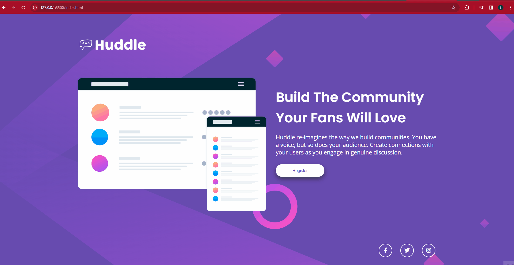
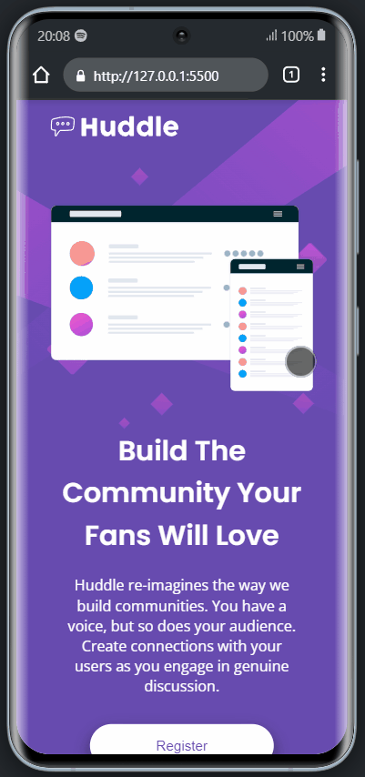

# Huddle Landing Page

Projeto realizado para conclusão do desafio do site FrontEnd Mentor e também do curso DevQuest - Dev em Dobro, onde fui desafiado a resolver utilizando flexbox e grid, fiz tudo sozinho,
consultando apensa meus resumos e relembrando conceitos através das aulas e vídeos do youtube, tentei ao máximo deixar igual ao do design, tanto no desktop quanto no mobile, deixando responsivo, espero que gostem!!

[]

[]

## Tecnologias utilizadas
- HTML
- CSS

## Coisas que aprendi
1 - Aprendi a pensar melhor em como achar as soluções para o layout do projeto sozinho.

2 - Como usar de forma mais prática e eficiente o flexbox juntamente com o grid.

2 - A como deixar o projeto responsivo sem ajuda.

## Onde senti dificuldade

Senti dificuladade na hora de tornar o projeto responsivo, bati um pouco de cabeça na hora de usar o media queries.